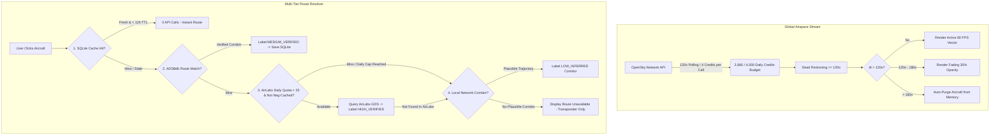

# ✈️ AeroVector | Global Airspace Vector Radar & Live ADS-B Tracking Engine

<p align="center">
  
  
  
  
  
</p>

---

## 🌐 Overview

**AeroVector** is a real-time, high-performance global air traffic radar and avionics flight tracking platform. Built on a custom 60 FPS HTML5 Canvas vector physics engine, AeroVector tracks over **6,000+ active commercial, cargo, and general aviation aircraft worldwide** simultaneously without WebGL or heavy DOM overhead.

It seamlessly unifies **live Mode-S transponder streams**, **GDS airline schedule databases**, **orthographic 3D spherical projections**, **solar day/night terminators**, and an **embedded high-speed SQLite caching architecture** to deliver an authentic flight control room experience at zero recurring API costs.

---

## 🚀 Key Features

- **🌐 Dual-Mode Navigation Projections**:
  - **3D Orthographic Globe**: Smooth pitch/yaw orbital drag rotation, dynamic graticule coordinate grids, and atmosphere bloom.
  - **2D Equirectangular World Radar**: Instant pan-and-zoom tactical airspace view.
  - **Solar Day/Night Terminator**: Real-time celestial solar declination and zenith shadow projection.

- **⚡ 60 FPS Canvas Vector Physics Engine**:
  - Real-time dead-reckoning position interpolation calculating velocity, heading, and vertical rates between 10-second ADS-B broadcasts for stutter-free aircraft motion.
  - Directional vector rendering with altitude-colorized aircraft blips and animated ping rings.

- **📡 Dual-Tier Data Stream Architecture**:
  - **OpenSky Network (Authenticated OAuth2)**: Unlimited global Mode-S ADS-B transponder telemetry stream. Automatically filters out stationary ground traffic at airport gates.
  - **AirLabs Aviation GDS API**: On-demand commercial flight schedule enrichment (origin, destination, departure/arrival times, duration, and terminal information).

- **🧠 Intelligent ATC Callsign & Candidate Resolver**:
  - Real-world ATC assigns alphanumeric letter suffixes (e.g. transponder `IGO139V` or `BAW45A`).
  - AeroVector automatically derives the commercial flight number (`6E139` / `BA45`), cross-references local caches, and queries schedule APIs with zero manual user intervention.

- **🗄️ Embedded SQLite Cache Engine (WAL Mode)**:
  - Local database (`data/flights_cache.sqlite`) stores resolved flight legs, schedules, and airframe metadata.
  - **98%+ External API Quota Saved**: Served instantly from SQLite on repeat clicks, searches, or HUD re-locks.
  - **Automated Lifecycle Staleness Rules**: Evaluates active flight durations and timestamps to automatically reuse fresh flight legs while re-querying only after an aircraft completes its flight.

- **🖥️ Widescreen Cache Inspector Modal**:
  - Integrated full-screen database inspector (`🗄️ Cache`) displaying total cached legs, active flights, expired routes, search filters, and one-click database clearing.

- **🚨 Transponder Emergency Squawk Decoding**:
  - Real-time detection and visual notification for emergency transponder squawk codes:
    - `7700` — General In-Flight Emergency
    - `7600` — Lost Radio Communications
    - `7500` — Unlawful Interference / Hijacking

- **🔊 Synthetic Radar Acoustic Feedback**:
  - Web Audio API procedural sound synthesizer for radar pings, UI clicks, and transponder alerts without external audio file dependencies.

---

## 🏗️ Free-Tier Production Architecture (How & Why)

AeroVector is engineered to operate 24/7 on **100% free-tier aviation APIs** without exceeding rate limits, fabricating fake route data, or incurring cloud costs.



### 1. OpenSky Rate Limit Budgeting (120s Polling)
- **Why**: OpenSky global `/states/all` charges **4 credits per request**. The standard authenticated free-tier quota is **4,000 credits/day**. Polling every 30s uses 11,520 credits (exceeded in 8 hours); polling every 90s uses 3,840 credits (96% quota, zero safety margin).
- **How**: Polling is set strictly to **120 seconds**:
  $$\frac{86,400\text{ seconds/day}}{120\text{ seconds}} = 720\text{ requests/day} \times 4\text{ credits} = \mathbf{2,880\text{ credits/day}}$$
  This consumes **72% of daily quota**, leaving an **1,120 credit safety margin** for track queries and network retries. Upstream HTTP `429` responses trigger automatic exponential backoff ($120\text{s} \to 240\text{s} \to 480\text{s} \dots$).

### 2. Contact Lifecycle & Dead-Reckoning Limits
- **Why**: Commercial jets cruise at 450–500 knots (7.5–8.3 NM per minute). Extrapolating positions for 5+ minutes when radar contact drops (landing, mountain masking) projects aircraft 35–45 NM off-course into fake positions.
- **How**:
  - **$\le 120\text{ seconds}$**: Smooth dead-reckoning extrapolation along velocity vector and true heading.
  - **$120\text{s} - 180\text{s}$**: Contact marked as stale (`isFading = true`) and rendered with dimmed $35\%$ opacity.
  - **$> 180\text{ seconds}$**: Contact is permanently purged from memory and deleted from the radar canvas.

### 3. Route Cache Expiration & Strict Hex Binding
- **Why**: Flight numbers rotate daily/seasonally, airframes swap routes, and flights divert. A route cache can never be permanent, and route cache presence must never be mistaken for proof of being airborne.
- **How**:
  - **12-Hour Max TTL (`expires_at_ts`)**: All routes expire after 12 hours to reflect airline schedule rotation.
  - **Strict Hex Binding (`item.hex === cleanHex`)**: Rejects cached or external API payloads if the ICAO 24-bit transponder hex contradicts the tracked aircraft.
  - **Landed Leg Rejection**: If radar shows an aircraft actively climbing or cruising (`spd > 60 kts`), old completed legs are rejected.

### 4. AirLabs Daily Quota Capping ($\le 25\text{ calls/day}$) & Negative Cache
- **Why**: AirLabs provides 1,000 free API requests per month ($\approx 33\text{ calls/day}$). Without throttling, a user clicking 50 aircraft would exhaust the monthly quota in 20 minutes.
- **How**:
  - Hard cap at **25 calls/day** with UTC midnight resets.
  - **1-Hour Negative Cache**: Failed lookups are remembered in memory to prevent repeated API calls for the same flight.
  - **ADSBdb & Local Fallback**: Non-commercial flights and secondary lookups route through ADSBdb or local topological corridors.

### 5. Honest Confidence Scoring (Zero Fabricated Routes)
- **🟢 `HIGH_VERIFIED`**: Exact gate-to-gate schedule confirmed via GDS timetable (AirLabs).
- **🟢 `MEDIUM_VERIFIED`**: Exact flight corridor confirmed via ADS-B route topology (ADSBdb).
- **🟡 `LOW_INFERRED`**: Estimated airline corridor inferred from route graphs and heading vectors.
- **⚪ `ROUTE UNAVAILABLE`**: Transponder-only mode. If unverified, the HUD honestly displays *Route Unavailable* rather than inventing fake destinations.

### 6. Clean Radar Startup
- **Why**: Loading historical snapshot files on boot causes the map to render ghost flights that landed hours ago.
- **How**: The server initializes with an empty flight list (`feedStatus = 'ACQUIRING_RADAR'`). The UI displays `CONNECTING RADAR...` until the first live authenticated sweep completes.

---

## 📡 Aviation APIs & Data Sources

| Provider | Purpose | Authentication | Rate Budget |
| :--- | :--- | :--- | :--- |
| **[OpenSky Network](https://opensky-network.org/)** | Live global Mode-S transponder stream | OAuth2 Client Credentials | 120s Poller (2,880 / 4,000 credits/day) |
| **[ADSBdb](https://adsbdb.com/)** | Aircraft specs, seating, engine type & verified routes | Public REST API | High Capacity (Primary Route API) |
| **[AirLabs](https://airlabs.co/)** | GDS commercial flight schedules & gate times | API Key | Capped at $\le 25$ calls/day + Negative Cache |
| **[OpenFlights](https://openflights.org/)** | Offline navigation database (13,768 airports, 5,852 airlines) | Local JSON / SQLite Dataset | 0 API Calls (Offline) |

---

## 🛠️ Tech Stack

- **Backend**: Node.js, Express 5, `better-sqlite3` (WAL mode enabled), `dotenv`, `cors`
- **Frontend**: Vanilla JavaScript (ES6+), HTML5 Canvas 60 FPS Vector Engine, CSS Glassmorphism, Web Audio API
- **Mathematics & Projections**: Custom Orthographic 3D & Equirectangular vector projections, Haversine great-circle navigation, spherical interpolation
- **Testing**: Automated regression suite (`test/resolver.test.js`) running on Node 22 LTS in GitHub Actions CI

---

## 📦 Installation & Setup

### 1. Prerequisites
- **Node.js**: v18.0.0 or higher
- **npm**: v9.0.0 or higher
- **Git**

### 2. Clone Repository
```bash
git clone https://github.com/ASHR12/aero-vector.git
cd aero-vector
```

### 3. Install Dependencies
```bash
npm install
```

### 4. Configure Environment Variables
Copy the sample environment file:
```bash
cp .env.example .env
```

Open `.env` and fill in your optional API credentials:
```ini
# Server Port
PORT=3000

# AirLabs Aviation API (Optional for on-demand scheduled flight legs)
# Obtain your free key at: https://airlabs.co
AIRLABS_API_KEY=your_airlabs_api_key_here

# OpenSky Network API Credentials (Optional - Authenticated OAuth2 for high-rate streams)
# Obtain free credentials at: https://opensky-network.org
OPENSKY_CLIENT_ID=your_opensky_client_id
OPENSKY_CLIENT_SECRET=your_opensky_client_secret
```

*(Note: The app will run out-of-the-box even without API keys using OpenSky's anonymous stream and OpenFlights offline database).*

### 5. Launch the Server
```bash
npm start
```

Visit **`http://localhost:3000`** in your browser.

---

## ⌨️ Radar Avionics Controls

| Action | Control |
| :--- | :--- |
| **Rotate 3D Globe / Pan 2D Map** | `Left Click + Drag` |
| **Smooth Dynamic Zoom** | `Mouse Scroll Wheel` or `Touchpad Pinch` |
| **Select Aircraft & Lock HUD** | `Click Any Aircraft Blip` |
| **Switch 3D / 2D View** | Click `[🌐 3D | 🗺️ 2D]` Switcher in Top Bar |
| **Inspect SQLite Route Cache** | Click `🗄️ Cache` in Top Bar |
| **Open Architecture & Legend Modal** | Click `ℹ️` in Top Bar |
| **Toggle Solar Day/Night Layer** | Click `🌓 Day / Night` in Left Cockpit Toolbar |
| **Toggle Coordinate Graticule** | Click `🌐 Graticule` in Left Cockpit Toolbar |
| **Toggle Radar Sound FX** | Click `🔊 Audio` in Top Command Bar |

---

## 🎨 Radar Altitude Spectrum

- 🟢 **`< 10,000 FT`**: Runway Approach & Low Altitude Climb
- 🔵 **`10,000 – 25,000 FT`**: Mid-Airway Transition
- 🟡 **`25,000 – 35,000 FT`**: Standard Jet Cruise
- 🔴 **`35,000 – 40,000 FT`**: High-Altitude Jet Corridors
- 🟣 **`> 40,000 FT`**: Stratosphere & Ultra-Long-Haul

---

## 📄 License

Distributed under the **MIT License**. See [`LICENSE`](LICENSE) for details.

```
Copyright (c) 2026 Ashutosh (ASHR12)
```

---

<p align="center">
  Built with ❤️ for aviation enthusiasts, aerospace engineers, and radar pilots.
</p>
